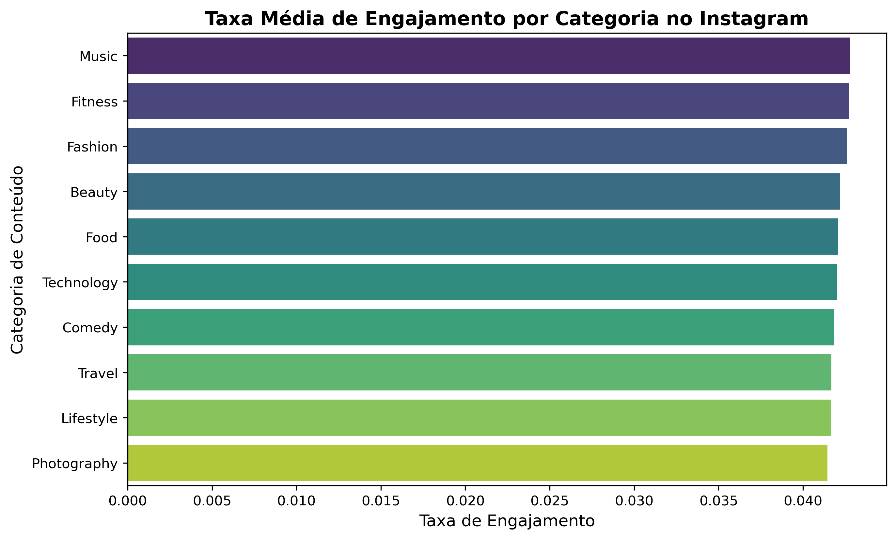
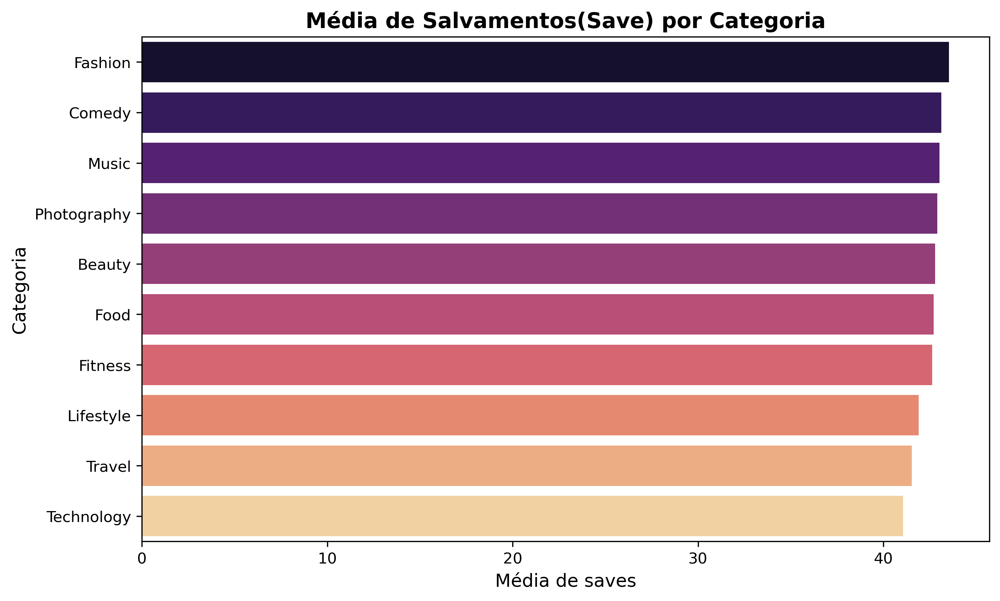
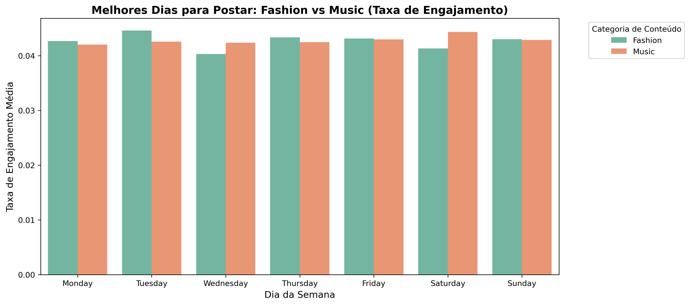

# 📊 Análise de Desempenho em Mídias Sociais - Instagram 🤳

Este projeto foi desenvolvido como parte do curso de Ciência de Dados do **Coursera**, simulando o papel de um Analista de Mídias Sociais em uma agência de marketing especializada.

## 📝 Cenário do Projeto
Uma agência de marketing precisa otimizar a estratégia de seus clientes no Instagram. O objetivo é analisar o desempenho de diferentes categorias de postagens (Saúde, Tecnologia, Comédia, etc.) para identificar quais geram maior alcance e engajamento. 

Com esses dados, a agência poderá fazer recomendações baseadas em evidências para melhorar os resultados dos clientes dentro do orçamento e prazos estabelecidos.

## 🎯 Objetivos
* Extrair e carregar dados de redes sociais (dataset do Kaggle).
* Limpar e processar os dados utilizando Python.
* Analisar o engajamento médio e salvamentos (saves) por categoria de conteúdo.
* Identificar os melhores dias para postagem cruzando categorias de alto desempenho.
* Visualizar os resultados para facilitar a tomada de decisão da equipe de marketing.

## 🛠️ Ferramentas Utilizadas
* **Python**
* **Pandas**: Manipulação e limpeza de dados.
* **Numpy**: Suporte matemático.
* **Matplotlib & Seaborn**: Visualização de dados e criação de gráficos.
* **Git & GitHub**: Versionamento de código.

## 📂 Estrutura do Repositório
* `SocialMediaDataAnalysis.ipynb`: Jupyter Notebook contendo todo o código da análise.
* `Instagram_Analytics.csv`: Base de dados utilizada no projeto (via Kaggle).
* `README.md`: Documentação do projeto.

## 📈 Resultados da Análise

Durante a análise exploratória, investigamos métricas principais para direcionar a estratégia de conteúdo da agência:

### 1. Taxa de Engajamento Imediato (Likes e Comentários)


A análise revela que categorias ligadas a entretenimento e estilo de vida dominam a interação imediata do público. O top 3 é composto por:
1. **Music** (4,28%)
2. **Fitness** (4,27%)
3. **Fashion** (4,26%)

### 2. Retenção e Utilidade (Média de Saves)


Quando analisamos os "Saves" (indicador de que o usuário achou o conteúdo útil para guardar e rever), o cenário reafirma a força de certos nichos:
1. **Fashion**
2. **Comedy**
3. **Music**

### 3. Melhor Momento para Postagem (Timing)


Aprofundando a análise nas duas categorias de maior destaque (Fashion e Music), identificamos padrões de comportamento distintos durante a semana:
* **Fashion:** O pico de engajamento ocorre nas **Terças-feiras**. O meio da semana (Quarta-feira) apresenta a maior queda de interesse.
* **Music:** O engajamento atinge o seu pico máximo aos **Sábados**, alinhando-se perfeitamente com os hábitos de lazer e entretenimento de final de semana.

## 💡 Recomendação Estratégica Final
Para maximizar o ROI dos clientes da agência, recomendamos o seguinte calendário de ativação:
1. **Campanhas de Moda (Fashion):** Concentrar o maior volume de orçamento e postagens de alto impacto nas **Terças-feiras**.
2. **Campanhas de Música e Entretenimento:** Reservar os principais lançamentos e ações de marketing para os **Sábados**.


## 🚀 Como Executar
1. Clone este repositório:
   ```bash
   git clone https://github.com/pedrobittencourtdev/instagram-analytics.git
2. Certifique-se de ter o Python e as bibliotecas necessárias instaladas:
    ```bash
    pip install pandas numpy matplotlib seaborn

3. Abra o arquivo .ipynb em um ambiente Jupyter ou VS Code.